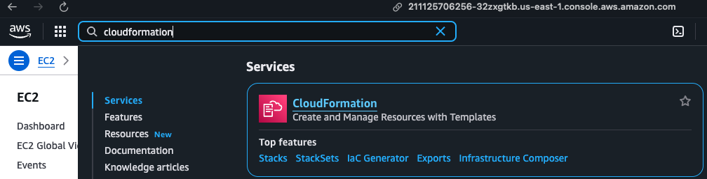
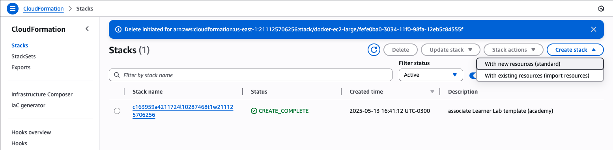
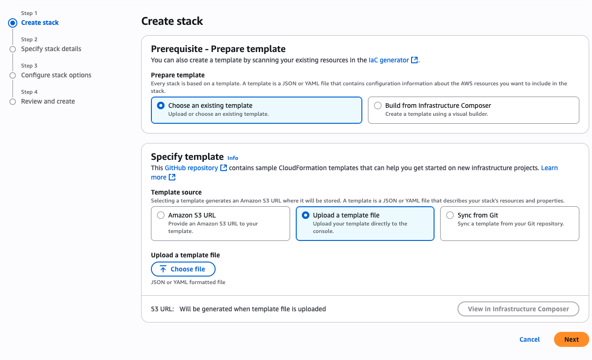
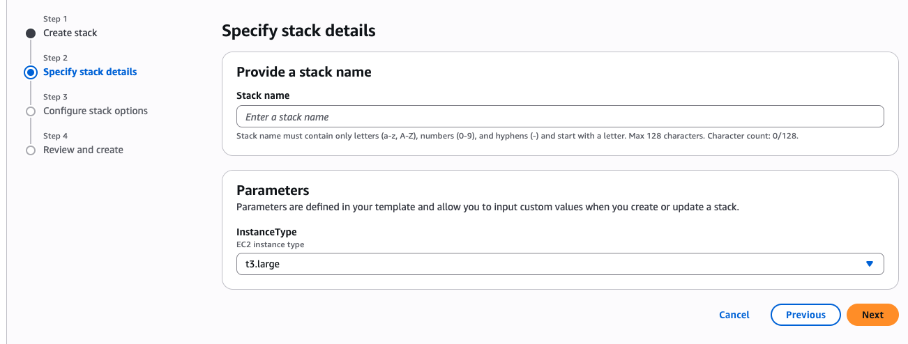

# Desplegando recursos usando CloudFormation

### Instancia EC2 con Docker instalado

* Ir a AWS CloudFormation
* En el menú `Create Stack`
* * Seleccionar la opción `With new resources (standard)`
* Choose an existing template
* * Opción `Upload a template file`
* Asignar un nombre al Stack
* Bajo Parameters seleccionar el tipo de instancia
* Finalmente, clikear en `Submit`

1. 

2. 

3.

4.

